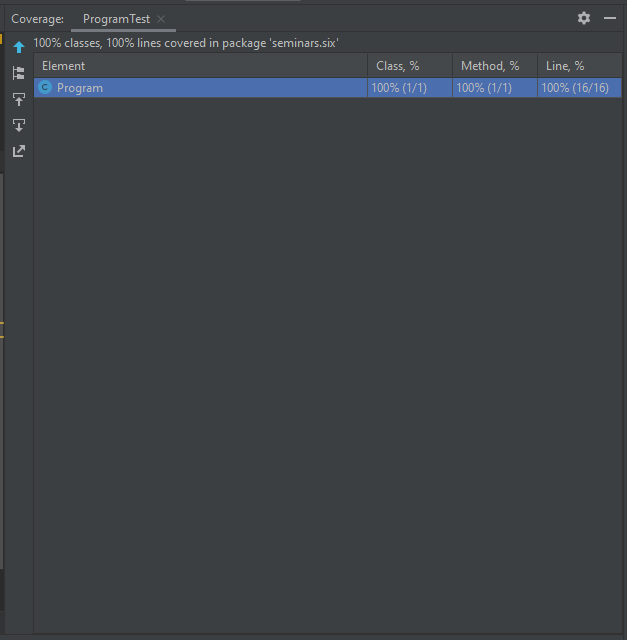

# Объяснение того, какие сценарии покрыты тестами и почему вы выбрали именно эти сценарии

1. "setUp": Нужен для того чтобы избежать повторений в самих тестах

2. "listAverageFirst": Этот тест для проверки метода, когда среднее значение первого списка больше
    Результат должен быть: "Первый список имеет большее среднее значение"
    
3. "listAverageSecond": Этот тест для проверки метода, когда среднее значение второго списка больше
    Результат должен быть: "Второй список имеет большее среднее значение"
    
4. "listAverageBoth": Этот тест для проверки метода, когда среднее значение обоих списков равны
    Результат должен быть: "Средние значения равны"
   
5. Были выбраны именно эти тесты для 100% покрытия кода программы
    
# Скриншот покрытия кода

